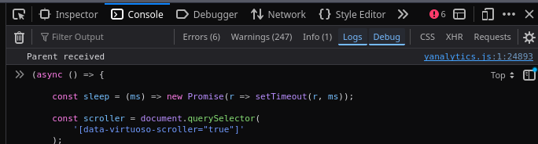
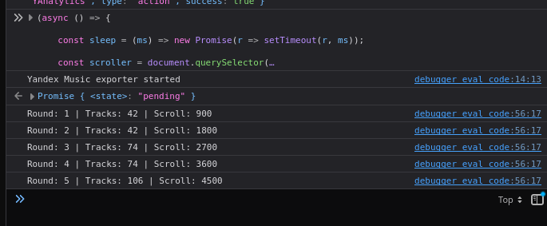
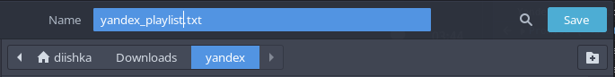
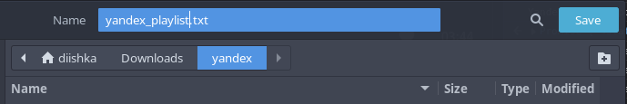

# yandex-to-spotify

Export full playlists from Yandex Music to TXT/JSON for importing into Spotify, TuneMyMusic, Soundiiz and other services.
## Features

* Exports full playlists
* Works with virtualized Yandex Music lists
* Firefox compatible
* TXT export
* JSON backup export
* Automatic scrolling
* Duplicate filtering

## How to use

1. Open your playlist on Yandex Music
2. Scroll to the very top
3. Press F12
4. Open Console

5. Paste `exporter.js`
6. Press Enter
7. Wait until export finishes

The script will automatically download:

* `yandex_playlist.txt`
* `yandex_playlist_backup.json`

## Import into Spotify

You can import the TXT file using:

* TuneMyMusic
* Soundiiz

## Supported browsers

* Firefox
* Chrome
* Edge

## Notes

Yandex Music uses virtual scrolling, so normal scraping methods often miss tracks. This script collects tracks while scrolling.

## License

MIT

